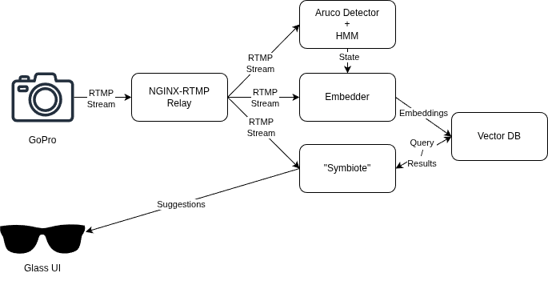

# AI Through Symbiosis

> **🐳 New: Docker Support for HTK HMM State Detection** - See `DOCKER_SETUP.md` for containerized deployment. Recommended for Windows users to avoid HTK installation issues.

## Description

AI Through Symbiosis is the idea that an AI should be able to learn through the actions we (as humans) take every day so they can assist in small natural ways.  Specifically, imagine the scenario of a warehouse (the main focus of this project).  In a warehouse, workers pick items and add them to a given dropoff location.  In this scenario, the worker is completing the same task continually so an AI system should be able to learn from the worker.  Specifically, the AI should be able to learn what items are being picked so that it could (eventually) be able to offer advice and corrections to the worker if they are picking the incorrect items.

## "Symbiotic" System

The project has been divided into a number of microservices to reduce the computational overhead of running the various AI models necessary to facilitate the system.  The system diagram is as shown:

### GoPro / Camera 

The GoPro camera captures a video stream that it projects over RTMP to the NGINX-RTMP Relay.  Ideally, the GoPro could be converted to the onboard camera of the Google Glass, however the field of view of the Glass camera is currently sub-ideal for viewing the hands of the user.

### NGINX-RTMP Relay

GoPros can only RTMP stream to a singular consumer so the NGINX-RTMP relay serves as a relay for the RTMP stream so that multiple subscribers can view the RTMP stream at the same time.  In our case, these subscribers are the Detector, Embedder, and Symbiote.

### Detector

The detector is responsible for using the AruCo markers to detect when a use has picked up an item.  Specifically, we have separated the picking process into four states ("Pick", "Carry", "Place", and "Carry Empty").  The detector will also run a hidden markov model (HMM) and publish the current state to the Embedder and "Symbiote" to increase their knowledge of the situation.

### Embedder

The embedder is responsible for converting the images captured during the "Carry" stage into embedding vectors in some latent space such that images of the same object will be locally similar.

### Symbiote

Over time, the symbiote will obtain better representations of the mapping between order ids and items via querying the vector database and using images captured during the "Carry" stage to make informed decisions about whether the correct object has been selected by the user.  As it gets more confident, it will also alert the user to whether or not they have likely selected the correct object.

### Vector Database

The vector database stores embeddings from the Embedder and is queried by the "Symbiote" to make better and better predictions of what objects are picked and desired.

### Glasses Application

The "Symbiote" will offer insights to the Glasses application to inform the user whether they have successfully selected the correct item or not.
